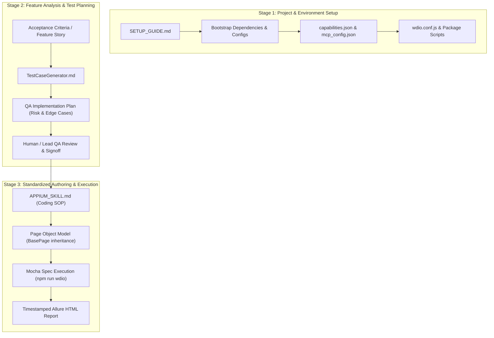

# MYBOS Building Manager (BM) Automation
## CTO Presentation & Demonstration Playbook

> **Target Audience:** Chief Technology Officer (CTO) & Engineering Leadership  
> **Goal:** Demonstrate the end-to-end mobile test automation framework for the MYBOS BM Hybrid Mobile Application, showing project setup, AI-driven QA workflows, live execution, and standard operating procedures (SOPs).

---

## 1. Executive Summary & Value Proposition

### Key Highlights to Pitch to the CTO:
1. **Enterprise-Grade Foundation:** Built on **WebdriverIO + Appium 2.0** with **Mocha framework**, designed specifically for **Hybrid Mobile Apps (Flutter + WebView)**.
2. **Zero-Flakiness Guarantee:** Enforces explicit waits (`waitForDisplayed`), deterministic authentication state recovery (`AuthHelper`), and W3C touch gestures instead of hardcoded sleeps or brittle coordinate taps.
3. **AI-Assisted QA Velocity:** Standardized Markdown SOPs allow AI agents (like Antigravity / Gemini) to analyze product Acceptance Criteria, generate comprehensive risk-based test plans, and write production-ready test code following strict engineering standards.
4. **Instant Stakeholder Transparency:** Automatically generates standalone, self-contained single-file Allure HTML reports (`TestReport_YYYY-MM-DD_HH-mm-ss.html`) complete with colored logs and step-level action tracing.

---

## 2. The 3-Stage QA Automation Lifecycle & MD File Order

The framework operates under a strict **3-Stage Lifecycle**. The three Markdown files represent the Standard Operating Procedures (SOPs) for each phase of test automation:



---

### Phase-by-Phase Breakdown of the MD Files

| Order | Document | Role & Purpose | When to Use |
| :--- | :--- | :--- | :--- |
| **Stage 1** | `SETUP_GUIDE.md` | **Project Bootstrap SOP:** Outlines one-time environment setup, NPM dependencies, Appium capability mapping (`capabilities.json`), IDE MCP server integration (`mcp_config.json`), WebdriverIO configuration (`wdio.conf.js`), and basic baseline tests. | When setting up a new machine, onboarding a new engineer, or setting up CI/CD pipelines. |
| **Stage 2** | `TestCaseGenerator.md` | **AI QA Planning Prompt SOP:** Instructions for the AI to act as a Senior QA Planning Agent. Converts raw user stories/AC into a structured QA Implementation Plan (positive/negative scenarios, edge cases, state transitions, security, regression impact) *before* writing code. | During sprint planning or feature refinement, before any automated code is written. |
| **Stage 3** | `APPIUM_SKILL.md` | **Test Coding Standard Operating Procedure (SOP):** Strict architecture rules for writing maintainable test code. Enforces Page Object Model (`BasePage`), locator priorities, `AuthHelper` state isolation, handling AC changes, ADB permissions, and Allure logging. | When authoring or updating specs (`.spec.js`), page objects (`.page.js`), or test data (`.data.json`). |

---

## 3. Step-by-Step Live Presentation Agenda & Script

### Agenda Overview (25-30 Minutes Total)
1. **High-Level Pitch & Architecture Overview** (5 mins)
2. **Framework Structure & SOP Deep Dive** (7 mins)
3. **Live Execution & Allure Reporting Demo** (8 mins)
4. **Live AI-Assisted Test Generation Demo** (5 mins)
5. **Q&A & Scaling Strategy** (5 mins)

---

### Step 1: High-Level Pitch & Architecture (5 mins)
* **Goal:** Set the context and explain why this architecture was chosen.
* **Talking Points:**
  - *"We have established an enterprise-grade automation framework for our MYBOS BM mobile app using WebdriverIO and Appium."*
  - *"The app has a hybrid architecture (Flutter views + embedded WebViews). Our framework seamlessly handles context switching and multiline Flutter content-descriptions without breaking."*
  - *"Instead of ad-hoc test scripts, we developed a 3-tier SOP system (`SETUP_GUIDE.md`, `TestCaseGenerator.md`, `APPIUM_SKILL.md`) that turns AI from a simple code generator into a disciplined QA engineer following our team's exact standards."*

---

### Step 2: Framework Structure & MD File Walkthrough (7 mins)
* **Goal:** Show the code organization and explain the role of each MD file.
* **Files to open in VS Code / IDE:**
  - `SETUP_GUIDE.md`: Point out how it guarantees 5-minute project bootstrapping.
  - `TestCaseGenerator.md`: Point out how it forces thorough exploratory thinking (boundary analysis, risk scoring) before coding.
  - `APPIUM_SKILL.md`: Show the strict standards (Locator hierarchy, `BasePage` methods, Given/When/Then internal mapping, AC change management).
  - Codebase structure:
    - `test/specs/` (`login.spec.js`, `dashboard.spec.js`, `residents.spec.js`, `contractors.spec.js`, `library.spec.js`)
    - `test/pageobjects/` (`base.page.js`, `dashboard.page.js`, etc.)
    - `test/utils/` (`auth.helper.js`, `utils.js`)

---

### Step 3: Live Execution & Allure Report Generation (8 mins)
* **Goal:** Show live test execution on an Android Emulator and display the output.
* **Action:**
  1. Open terminal in project root.
  2. Launch your target Android Emulator.
  3. Execute a specific feature suite:
     ```bash
     npm run test:residents
     ```
     *(Or `npm run test:library` / `npm run wdio`)*
  4. Highlight in terminal:
     - Pre-test ADB permission granting (`POST_NOTIFICATIONS`).
     - Session management via `AuthHelper.ensureLoggedIn()`.
     - Explicit waits executing in real time.
  5. Show Report Generation:
     - Point out the `onComplete` hook in `wdio.conf.js` automatically compiling `allure-report/TestReport_YYYY-MM-DD_HH-mm-ss.html`.
     - Open the standalone HTML report in the browser. Show step-level action logs (`[ACTION] Tapped search button`, `[VERIFY] Resident details visible`).

---

### Step 4: Live AI-Assisted Pipeline Demonstration (5 mins)
* **Goal:** Demonstrate the speed and accuracy of generating a new test using the SOPs.
* **Action:**
  1. Open your AI IDE / Chat (Antigravity).
  2. Provide a sample Acceptance Criteria (e.g. *"User can search for a library document by title and filter by category"*).
  3. Reference `@TestCaseGenerator.md` to show the AI creating a structured QA Implementation Plan.
  4. Reference `@APPIUM_SKILL.md` to show the AI implementing the Page Object and Spec file following exact project conventions (`BasePage`, `waitAndTap`, `it()` naming).
  5. Highlight to CTO: *"Notice how the AI doesn't write random code — it strictly adheres to our `APPIUM_SKILL.md` rules."*

---

## 4. CTO Q&A & Technical Defense Guide

Be prepared for technical questions from the CTO with these pre-formulated responses:

### Q1: "How do you prevent test flakiness on slow emulators or CI runners?"
> **Answer:** "We eliminated flakiness through three strict rules in `APPIUM_SKILL.md`:
> 1. **Zero arbitrary pauses:** We banned hardcoded `browser.pause()` for element waiting, replacing them with explicit `waitForDisplayed({ timeout: 15000 })`.
> 2. **Pre-granted system permissions:** ADB shell commands (`pm grant`) inject notification permissions directly before tests run, suppressing OS permission popups.
> 3. **Smart Session Recovery:** `AuthHelper.ensureLoggedIn()` detects token expiration dialogs (`isTokenInvalid()`) and recovers the session automatically without failing the build."

### Q2: "How does the framework handle Flutter elements vs WebViews?"
> **Answer:** "In `APPIUM_SKILL.md`, locator strategy is explicitly tiered:
> 1. Accessibility IDs (`~id`) and Flutter `content-desc` multiline matching are prioritized.
> 2. For embedded HTML screens, `driver.switchContext('WEBVIEW')` allows full CSS/DOM selector usage, and switches back to `NATIVE_APP` cleanly when done."

### Q3: "What happens when Acceptance Criteria change for an existing feature?"
> **Answer:** "`APPIUM_SKILL.md` defines a clear AC change protocol:
> - AI and human engineers must search existing specs first before creating new files.
> - Modified AC updates only specific `it()` blocks or page object methods.
> - Removed AC scenarios are preserved using `it.skip('... OBSOLETE: removed per AC update YYYY-MM')` to retain historical context rather than silently dropping coverage."

### Q4: "Can this run headlessly in CI/CD?"
> **Answer:** "Yes. Section 10 of `SETUP_GUIDE.md` includes a ready-to-use GitHub Actions workflow (`.github/workflows/appium.yml`) utilizing `reactivecircus/android-emulator-runner` with hardware acceleration (KVM) enabled for headless execution."

---

## 5. Quick Reference Commands

| Task | Command |
| :--- | :--- |
| **Run Full Regression Suite** | `npm run wdio` |
| **Run Residents Feature** | `npm run test:residents` |
| **Run Library Feature** | `npm run test:library` |
| **Run Contractors Feature** | `npm run test:contractors` |
| **Run Dashboard Feature** | `npm run test:dashboard` |
| **Run Login Specs** | `npm run test:login` |
| **Generate Standalone Allure Report** | `npm run report` |
| **Open Allure Report** | `npm run allure:open` |
| **Clear App State via ADB** | `npm run clear-app` |

---
*Playbook prepared for MYBOS BM Automation Presentation.*
